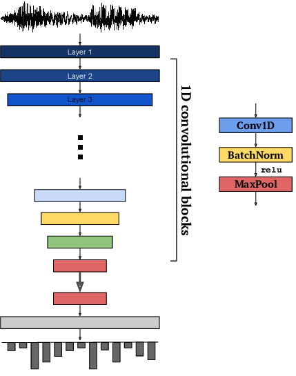

# Speech/Music Discrimination using SampleCNN

<p align="center">
  
</p>

Experimenting with [sample-level CNNs](https://arxiv.org/abs/1703.01789) for Speech/Music discrimination.

## Motivation

German public broadcasters such as _RBB radio1_ offer a myriad of interesting podcasts and programs. One of them is [Schöne Töne](https://www.radioeins.de/programm/sendungen/schoene_toene/), a two-hour broadcast dedicated to modern ambient, artcore, and orchestral music.

_radio1_ allows you to listen to the broadcast later over the internet. However, they don't bother removing the news/service block in middle of the audio track. Of course, I could rip it out by hand, but maybe we could try out a semi-automated way to do this with PyTorch.

## Implementation

We train a [SampleCNN](https://arxiv.org/abs/1703.01789) on the [GTZAN Music-Speech discrimination dataset](http://marsyas.info/downloads/datasets.html). The reasoning here is that the news segment almost purely consists of human speech. Therefore, a speech/music discrimination model would be a good fit here.

SampleCNN is trained with the recommended dropout value of 0.5; A cyclic learning rate scheduler (`CyclicLR`) is used to cycle through the range of learning rates and momentum hyperparameters for SGD.

Training samples are continously produced through randomized window sampling. The model receives 59049 samples (around ~3.7s @ 16 kHz) as an input. Each track in GTZAN is 30s long. With 120 tracks, the total number of example windows is `((16000*30)-59049+1)*120 = 50514240`. However, training for 20000 batches (with e.g. 32 sample windows per batch, about 640000 examples in total) is sufficient to produce a usable model.

## Test

Does it work? Seemingly, yes: Using the 10.10.2019 recording of _Schöne Töne_ as testing material, the discriminator correctly recognizes the ~5-minute long news block:

```
$ python3 -B discriminator st_20191010.wav 2>/dev/null
00:00:00 🎶 (0.000)
00:00:01 🎶 (0.000)
00:00:02 🎶 (0.000)
00:00:03 🎶 (0.000)
00:00:04 🎶 (0.000)
00:00:05 🎶 (0.000)
…
00:56:21 🎤 (0.964)
00:56:22 🎤 (1.000)
00:56:23 🎤 (1.000)
00:56:24 🎤 (1.000)
00:56:25 🎤 (1.000)
00:56:26 🎤 (1.000)
00:56:27 🎤 (1.000)
00:56:28 🎤 (1.000)
00:56:29 🎤 (1.000)
…
01:00:04 🎤 (0.723)
01:00:05 🎤 (0.909)
01:00:06 🎤 (0.933)
01:00:07 🎶 (0.043)
01:00:08 🎶 (0.009)
01:00:09 🎶 (0.074)
01:00:10 🎶 (0.007)
01:00:11 🎶 (0.003)
```

## Notes

The resulting model overfits to human speech (which is not disadvantageous in this case). Speech with music in the background is therefore classified as _music_ (which could be the correct decision, depending on who you ask). The threshold can be adjusted using the `--alpha` option in the discriminator.

A trained model is included. However, a Makefile that runs the training workflow and writes the model is provided.

## Dependencies

- torch
- librosa
- ffmpeg-python

The latter (ffmpeg-python) is used for audio file conversion and resampling in the discriminator. Note that you must have an `ffmpeg` binary somewhere in your `$PATH` for it to work.
